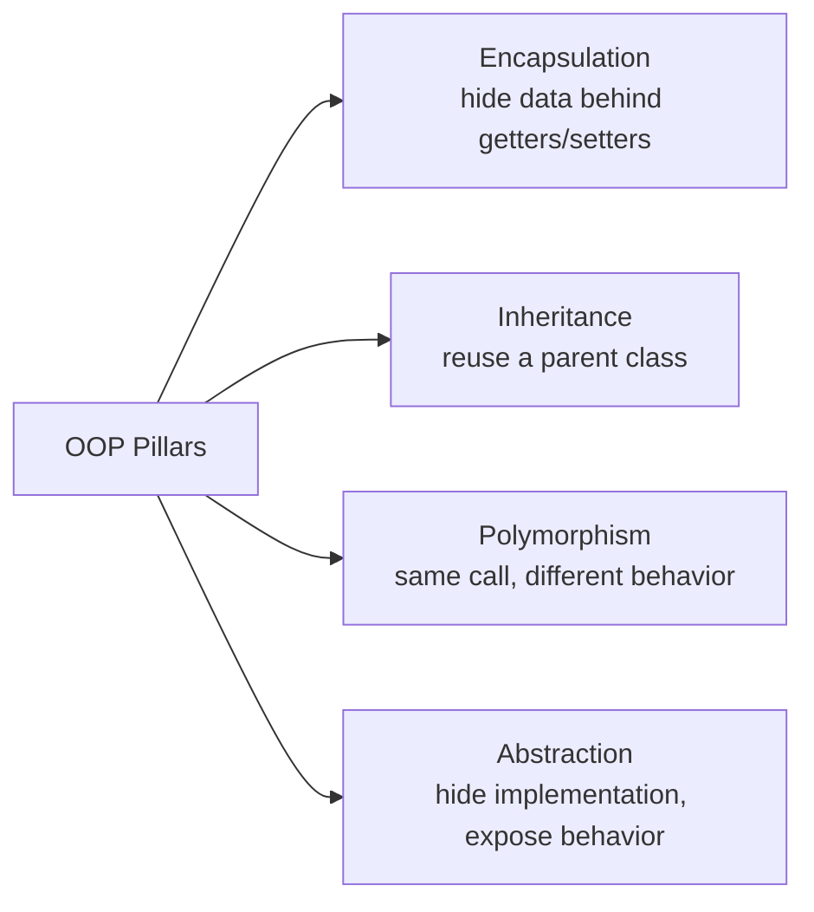
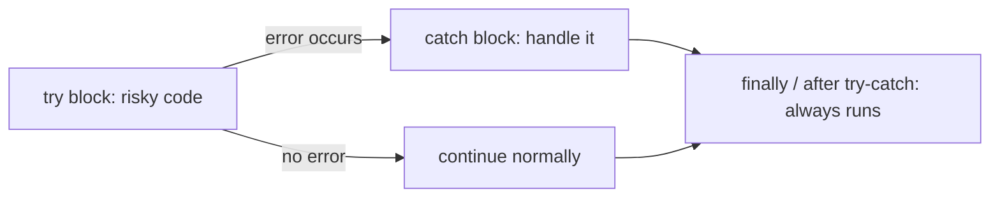
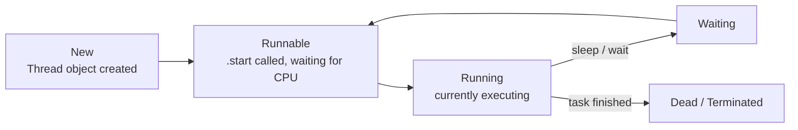
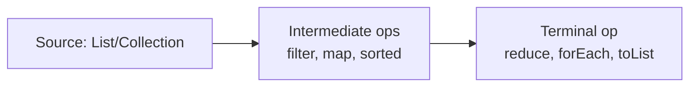

# Java Learning Notes

Simple, plain-English explanations for every program in this repo, grouped
the same way as the [README](../README.md). Click any file name to open the
actual code. Use this page to revise before diving back into the code.

---

## Quick Notes (things that are easy to forget)

- **Naming convention:** class names use `PascalCase` (`Calc`), variables and
  methods use `camelCase` (`marks`, `show()`), constants use `ALL_CAPS`
  (`PIE`, `BRAND`).
- **Constructors:** every constructor secretly starts with a call to
  `super()`, even if you never type it. That's how every class ends up
  connected to `Object`.
- **Every class in Java extends `Object`** whether you write `extends
  Object` or not — that's where `equals()`, `toString()`, `hashCode()` come
  from.
- **Java does not support multiple inheritance with classes** (a class
  cannot `extend` two classes) — see [`MultipleInheritance.java`](../MultipleInheritance.java).
  It *is* possible through interfaces, since a class can `implements`
  many interfaces.

---

## Core Java

### Basics

- **Hello World** — [`Hello.java`](../Hello.java)
  The smallest Java program. `main` is the entry point every program starts
  from; `System.out.println` prints text to the console.

- **Variables & Literals** — [`Variables.java`](../Variables.java), [`Literal.java`](../Literal.java)
  `Variables.java` shows declaring `int` variables and adding them.
  `Literal.java` shows the four ways to write the *same* integer 42:
  decimal (`42`), octal (`052`, leading `0`), hex (`0x2A`, leading `0x`),
  and binary (`0b101010`, leading `0b`).

- **Data Types** — [`DataTypes.java`](../DataTypes.java)
  Shows the primitive types (`int`, `float`, `double`, `char`, `boolean`)
  plus `String`, and prints each one.

- **Type Conversion** — [`TypeConversion.java`](../TypeConversion.java)
  **Explicit casting** (`(byte) a`) — you manually shrink a bigger type
  into a smaller one, risking data loss. **Implicit casting** (`a = b`) —
  Java automatically widens a smaller type into a bigger one, no data loss.

### Operators

- **Arithmetic Operators** — [`ArithmeticOperators.java`](../ArithmeticOperators.java)
  `+ - * / %` plus increment/decrement (`++`, `--`) and compound assignment
  (`+=`, `-=`). Note `num1++` (post) vs `++num1` (pre) — pre changes the
  value *before* it's used, post changes it *after*.

- **Relational Operators** — [`RelationalOperators.java`](../RelationalOperators.java)
  Comparisons that return `true`/`false`: `< > <= >= == !=`.

- **Logical Operators** — [`LogicalOperators.java`](../LogicalOperators.java)
  Combine booleans: `&&` (AND — both must be true), `||` (OR — either can
  be true), `!` (NOT — flips the value).

- **Ternary Operator** — [`Ternary.java`](../Ternary.java)
  A one-line if-else: `condition ? valueIfTrue : valueIfFalse`. Used here
  to find the minimum of two numbers.

### Control Flow

- **If-Else** — [`IfElse.java`](../IfElse.java) / **If-Else-If** — [`IfElseIf.java`](../IfElseIf.java)
  Branch code based on a condition. `IfElseIf` chains multiple conditions
  to check positive / negative / zero.

- **Switch Statement** — [`SwitchStatement.java`](../SwitchStatement.java)
  An alternative to many `if-else` blocks when comparing one variable
  against several fixed values. `break` stops it from "falling through"
  into the next case.

### Loops

- **For Loop** — [`ForLoop.java`](../ForLoop.java)
  Best when you know how many times to repeat: `for(init; condition; step)`.

- **While Loop** — [`WhileLoop.java`](../WhileLoop.java)
  Repeats *while* a condition is true; condition checked **before** each run.

- **Do-While Loop** — [`DoWhileLoop.java`](../DoWhileLoop.java)
  Same as `while`, but the body runs **at least once** because the
  condition is checked **after** the run.

- **Enhanced For Loop** — [`EnhancedForLoop.java`](../EnhancedForLoop.java)
  The `for(int n : nums)` "for-each" style — simpler when you just need
  every element and don't need the index.

### Arrays

- **Creation of Array** — [`CreationOfArray.java`](../CreationOfArray.java)
  Fixed-size list of same-type values: `new int[4]`, filled by index.

- **Multi-Dimensional Array** — [`MultiDimensionalArray.java`](../MultiDimensionalArray.java)
  A "grid" — `int[3][4]` is 3 rows of 4 columns, filled with random numbers.

- **Three-Dimensional Array** — [`ThreeDimensionalArray.java`](../ThreeDimensionalArray.java)
  A "cube" of numbers — `int[3][4][5]`, needs three nested loops to
  fill/read every cell.

- **Jagged Array** — [`JaggedArray.java`](../JaggedArray.java)
  A 2D array where each row can have a **different length**
  (`nums[0]` has 4 columns, `nums[1]` has 3, `nums[2]` has 2).

- **Array of Objects** — [`ArrayOfObjects.java`](../ArrayOfObjects.java)
  An array doesn't have to hold primitives — here it holds `Students`
  objects, each with its own `rollno`, `name`, `marks`.

### Methods

- **Methods** — [`Methods.java`](../Methods.java)
  A method groups reusable logic. `playMusic()` returns nothing (`void`),
  `getPen(int cost)` takes a parameter and returns a `String`.

- **Method Overloading** — [`MethodOverloading.java`](../MethodOverloading.java)
  Same method name (`add`), **different parameter lists** (2 ints, 3 ints,
  2 doubles). Java picks the right one based on what you pass in.

- **Method Overriding** — [`MethodOverriding.java`](../MethodOverriding.java)
  A subclass (`B`) provides its **own version** of a method already
  defined in the parent (`A`). Calling `obj.show()` on a `B` runs `B`'s
  version, not `A`'s.

- **Calculator variants** — [`Calc.java`](../Calc.java), [`AdvCalc.java`](../AdvCalc.java), [`VeryAdvCalc.java`](../VeryAdvCalc.java)
  A chain of inheritance built up step by step: `Calc` (add, sub) →
  `AdvCalc extends Calc` (adds mul, div) → `VeryAdvCalc extends AdvCalc`
  (adds power). Used together in [`Inheritance.java`](../Inheritance.java).

  ```mermaid
  classDiagram
    Calc <|-- AdvCalc
    AdvCalc <|-- VeryAdvCalc
    class Calc { +add() +sub() }
    class AdvCalc { +mul() +div() }
    class VeryAdvCalc { +power() }
  ```

### Classes & Objects

- **Class and Object** — [`ClassAndObject.java`](../ClassAndObject.java)
  A **class** (`Calculator`) is a blueprint; an **object** (`calc`) is an
  actual instance built from that blueprint using `new`.

- **Anonymous Object** — [`AnonymousObject.java`](../AnonymousObject.java)
  `new A().show()` — creates an object and uses it immediately **without**
  storing it in a variable. Useful for one-off, throwaway use.

- **Constructors** — [`Constructor.java`](../Constructor.java)
  A constructor runs automatically when an object is created (`new
  Human()`), typically to set up initial values (here it hardcodes
  `age = 24`, `name = "Jhon"`).

- **Default vs Parameterized Constructor** — [`DefaultvsParameterizedConstructor.java`](../DefaultvsParameterizedConstructor.java)
  **Default constructor** takes no arguments and sets fixed values.
  **Parameterized constructor** takes arguments so each object can start
  with different values.

- **`this` Keyword** — [`ThisKeyword.java`](../ThisKeyword.java)
  `this` refers to "the current object". Mainly used in setters
  (`this.age = age`) to tell apart the field from the parameter that
  shares the same name.

- **`this` and `super` Method** — [`ThisAndSuperMethod.java`](../ThisAndSuperMethod.java)
  `super()` calls the parent class's constructor; `this()` calls
  **another constructor in the same class**. Only one of `this(...)` /
  `super(...)` can be used, and it must be the first line.

- **Getters and Setters** — [`GettersAndSetters.java`](../GettersAndSetters.java)
  Public methods (`getAge`, `setAge`) that read/write private fields —
  the standard way to access encapsulated data safely.

### OOP Concepts

The four pillars of Object-Oriented Programming, all demonstrated in this repo:



- **Encapsulation** — [`Encapsulation.java`](../Encapsulation.java)
  Fields (`name`, `age`) are `private`, only reachable through public
  getters/setters — this protects the data from being changed carelessly
  from outside the class.

- **Inheritance** — [`Inheritance.java`](../Inheritance.java)
  A class can reuse another class's fields/methods with `extends`. Here
  `VeryAdvCalc` ends up with `add`, `sub`, `mul`, `div`, and `power`
  because it inherited them down the chain from `Calc` → `AdvCalc`.

- **Multiple Inheritance** — [`MultipleInheritance.java`](../MultipleInheritance.java)
  Shows (in a commented-out line) that Java **does not allow** a class to
  `extends` two classes at once — this avoids the "diamond problem"
  (ambiguity about which parent's method wins). It *is* achievable
  through interfaces (a class can `implements` many interfaces) — see
  [`MoreOnInterface.java`](../MoreOnInterface.java).

- **Upcasting and Downcasting** — [`UpcastingAndDowncasting.java`](../UpcastingAndDowncasting.java)
  **Upcasting**: `A obj = new B();` — treating a child object as its
  parent type, always safe. **Downcasting**: `B obj1 = (B) obj;` —
  going back to the child type, needs an explicit cast and only works if
  the object really is a `B`.

- **Dynamic Method Dispatch** — [`DynamicMethodDispatch.java`](../DynamicMethodDispatch.java)
  When you call an overridden method through a parent-type reference,
  Java decides **at runtime** which version to run based on the object's
  **actual type**, not the reference's type. This is how runtime
  polymorphism works.

### Modifiers & Keywords

- **Access Modifiers** — [`AccessModifiers.java`](../AccessModifiers.java) (with [`B.java`](../B.java), [`Others/A.java`](../Others/A.java))
  Controls visibility: `public` (everywhere), `protected` (same package +
  subclasses), *default/package-private* (same package only), `private`
  (same class only). `A.marks` is `protected` so it's reachable from a
  subclass in another package (`C extends A`); `B.marks` is `private` so
  it's not reachable outside `B` at all.

- **Final Keyword** — [`FinalKeyword.java`](../FinalKeyword.java)
  `final` can apply to a **variable** (becomes a constant, can't be
  reassigned), a **method** (can't be overridden by a subclass), or a
  **class** (can't be extended at all).

- **Static Variable** — [`StaticVariable.java`](../StaticVariable.java)
  A `static` field belongs to the **class**, not to individual objects —
  every `Mobile` object shares the *same* `name`. Changing it through one
  object changes it for all.

- **Static Method** — [`StaticMethod.java`](../StaticMethod.java)
  A `static` method belongs to the class and can be called without
  creating an object (`Mobile.show1(obj1)`), commonly used for utility
  logic or to work with static fields.

- **Static Block** — [`StaticBlock.java`](../StaticBlock.java)
  A `static { ... }` block runs **once**, automatically, when the class
  is first loaded (here triggered by `Class.forName("Mobile")`) —
  typically used to initialize static fields.

### Strings

- **Strings** — [`WhatIsString.java`](../WhatIsString.java)
  `new String("Hari")` creates a `String` object; `.concat("haran")`
  joins another string onto it (returns a new string — strings don't
  change in place).

- **Mutable vs Immutable String** — [`MutableVsImmutableString.java`](../MutableVsImmutableString.java)
  `String` is **immutable** — `name += "haran"` doesn't change the
  original string, it creates a brand-new one. Two literal strings with
  the same text (`"Hari"`) can share the same memory (same `hashCode`),
  which is why `s1 == s2` can be `true` for literals.

- **StringBuffer and StringBuilder** — [`StringBufferAndStringBuilder.java`](../StringBufferAndStringBuilder.java)
  Unlike `String`, `StringBuffer` is **mutable** — `append`/`insert`
  change the same object instead of creating new ones each time, which is
  much faster for lots of string edits. (`StringBuilder` is the same idea
  but not thread-safe, `StringBuffer` is.)

### Wrapper Classes & Object Class

- **Wrapper Class** — [`WrapperClass.java`](../WrapperClass.java)
  Every primitive has an object "wrapper" (`int` → `Integer`).
  **Auto-boxing**: primitive → wrapper automatically (`Integer num1 =
  num;`). **Auto-unboxing**: wrapper → primitive automatically. Also
  shows `Integer.parseInt("12")` to convert text to a number.

- **Object Class — `equals()`, `toString()`, `hashCode()`** — [`ObjectClassEqualsToStringHashcode.java`](../ObjectClassEqualsToStringHashcode.java)
  Every class inherits these from `Object`. `equals()` is overridden here
  to compare **content** (`model` and `price`) instead of the default
  behavior of comparing memory addresses (`==`). `toString()` is
  overridden to control what gets printed instead of a cryptic default
  string.

### Memory

- **Stack and Heap** — [`StackAndHeap.java`](../StackAndHeap.java)
  Local variables (`num1`, `num2`) live on the **stack** — fast, and
  cleared automatically when the method ends. Objects (`obj`, `obj1`)
  live on the **heap** — each `new Calculator()` gets its own separate
  memory, which is why changing `obj.num` doesn't affect `obj1.num`.

### Packages

- **Packages** — [`Packages.java`](../Packages.java), [`Others/`](../Others/)
  Packages group related classes and avoid naming clashes (e.g. `Calc`
  in the default package vs `Others.tools.Calc`). `import Others.tools.*`
  pulls in everything from that package.

---

## Advanced Java

### Interfaces

- **What Is Interface** — [`WhatIsInterface.java`](../WhatIsInterface.java)
  An interface is a **contract** — it lists method signatures
  (`void show();`) with no body. A class `implements` it and must provide
  the actual code. Fields in an interface are implicitly `public static
  final` (constants).

- **Need of Interface** — [`NeedOfInterface.java`](../NeedOfInterface.java)
  Shows *why* interfaces matter: `Developer.devApp(Computer lap)` can
  accept **any** class that implements `Computer` (`Laptop`, `Desktop`,
  or any future one) — this is loose coupling / programming to an
  interface, not a concrete class.

- **More on Interface** — [`MoreOnInterface.java`](../MoreOnInterface.java)
  A class can implement **multiple interfaces** (`class B implements
  A, Y`) — this is how Java gets around not supporting multiple class
  inheritance. Also shows one interface `extends` another (`Y extends
  X`).

- **Functional Interface** — [`FunctionalInterfaceNew.java`](../FunctionalInterfaceNew.java)
  An interface with **exactly one** abstract method, marked with
  `@FunctionalInterface`. This is what makes lambda expressions possible
  — a lambda is just a short way to implement that one method.

**Types of interfaces, in short:**
1. **Normal interface** — has multiple methods (e.g. [`WhatIsInterface.java`](../WhatIsInterface.java)).
2. **Functional interface / SAM** (Single Abstract Method) — exactly one method, so it can be implemented with a lambda (e.g. [`FunctionalInterfaceNew.java`](../FunctionalInterfaceNew.java)).
3. **Marker interface** — has **no methods at all**; it just "marks" a class as having some capability. Example: `Serializable` marks a class as safe to save (serialize) to disk and later reload (deserialize) from disk.

### Abstraction & Inner Classes

- **Abstract Keyword** — [`AbstractKeyword.java`](../AbstractKeyword.java)
  An `abstract class` can mix real methods (`playMusic()`) with abstract
  ones that have no body (`drive()`, `fly()`) — subclasses are forced to
  fill those in. It also **cannot be instantiated directly** (`new
  Car()` is not allowed).

- **Abstract and Anonymous Inner Class** — [`AbstarctAndAnonumousInnerClass.java`](../AbstarctAndAnonumousInnerClass.java)
  Instead of writing a full subclass, you can implement an abstract
  class's methods **on the spot** with `new A(){ ... }` — this creates
  an unnamed ("anonymous") subclass just for that one object.

- **Inner Class** — [`InnerClass.java`](../InnerClass.java)
  A class defined **inside** another class. Here `B` is a `static` inner
  class of `A`, created with `A.B obj1 = new A.B();` — used when a
  helper class only makes sense in the context of its outer class.

- **Anonymous Inner Class** — [`AnonymousInnerClass.java`](../AnonymousInnerClass.java)
  Same idea as the abstract version above, but overriding a method of a
  **normal (non-abstract) class** on the fly — a quick one-off override
  without creating a named subclass.

### Enums

- **What Is Enum** — [`WhatIsEnum.java`](../WhatIsEnum.java)
  `enum` defines a **fixed set of named constants** (`Running, Failed,
  Pending, Success`). `.ordinal()` gives each one's position (starting
  at 0).

- **Enum Class** — [`EnumClass.java`](../EnumClass.java)
  Enums can have **fields, constructors, and methods** just like a
  class — each constant (`MacBook(2000)`) can carry its own data
  (`price`), and `Laptop.values()` loops through all constants.

- **Enum with If and Switch** — [`EnumIfAndSwitch.java`](../EnumIfAndSwitch.java)
  Enums work naturally with both `if/else` (`s == Status.Running`) and
  `switch` (`case Running:`) for branching logic based on state.

### Exception Handling



**Error types, in short:**
1. **Compile-time error** — code doesn't even compile (a typo like `System.out.Println`).
2. **Runtime error (Exception)** — code compiles fine but breaks while running (divide by zero, null access) — handled with try/catch.
3. **Logical error** — code runs and compiles fine but produces the *wrong* result because the logic itself is wrong (no exception is thrown, so it's the hardest to catch).

- **What Is Exception** — [`WhatIsException.java`](../WhatIsException.java)
  Shows all three error types side by side: a typo is a compile-time
  error; `n1+n2+1` still compiles and runs, but silently returns the
  wrong answer — a logical error.

- **Exception Handling using Try-Catch** — [`ExceptionHandlingUsingTryCatch.java`](../ExceptionHandlingUsingTryCatch.java)
  `18/i` with `i = 0` throws `ArithmeticException`. Wrapping it in
  `try { ... } catch(Exception e) { ... }` stops the crash and lets the
  program keep running.

- **Try with Multiple Catch** — [`TryWithMultipleCatch.java`](../TryWithMultipleCatch.java)
  One `try` block can be followed by **several `catch` blocks**, each
  handling a different exception type (`ArithmeticException`,
  `ArrayIndexOutOfBoundsException`, then a general `Exception` as a
  catch-all). Java checks them top to bottom and runs the first match.

- **Try with Resources** — [`TryWithResources.java`](../TryWithResources.java)
  `try(BufferedReader br = ...)` automatically **closes** the resource
  (`br.close()`) when the block ends, even if an exception happens —
  no need for a manual `finally { br.close(); }`.

- **Throw Keyword** — [`ExceptionThrowKeyword.java`](../ExceptionThrowKeyword.java)
  `throw new ArithmeticException("...")` **manually raises** an
  exception yourself, instead of waiting for Java to throw one — useful
  to flag a situation your own code considers invalid.

- **Ducking Exception using Throws** — [`DuckingExceptionUsingThrows.java`](../DuckingExceptionUsingThrows.java)
  `throws ClassNotFoundException` on a method signature means "I'm not
  handling this here — whoever calls me has to." The exception is
  "ducked" up to the caller (`main`), which then has to `try/catch` it.

- **Custom Exception** — [`CustomeException.java`](../CustomeException.java)
  You can define your own exception type (`class HariException extends
  RuntimeException`) to represent a problem specific to your program,
  then `throw`/`catch` it just like a built-in one.

### Multithreading

**Thread states, in short:**
`New → Runnable → Running → Waiting → Dead`



- **Runnable vs Thread** — [`RunnableVsThread.java`](../RunnableVsThread.java)
  A `Runnable` is just "a task to run" (here written as a lambda);
  wrapping it in a `Thread` and calling `.start()` runs it
  **concurrently** with the rest of the program instead of sequentially.

- **Multiple Threads** — [`MultipleThreads.java`](../MultipleThreads.java)
  Two threads (`A`, `B`, each `extends Thread`) run **at the same time**
  once `.start()` is called on both — output from "hi" and "hello" ends
  up interleaved because the OS switches between them unpredictably.

- **Thread Priority and Sleep** — [`ThreadPriorityAndSleep.java`](../ThreadPriorityAndSleep.java)
  `Thread.sleep(ms)` pauses a thread for a bit (lets other threads run).
  Priority (`setPriority`) is a *hint* to the scheduler about which
  thread should get more CPU time — not a hard guarantee.

- **Race Condition** — [`RaceCondition.java`](../RaceCondition.java)
  Two threads both call `c.increment()` 10,000 times each; without
  protection, `count++` isn't atomic (it's really read → add → write),
  so updates can be lost when threads interleave badly. `synchronized`
  on the method locks it so only **one thread at a time** can run it,
  guaranteeing the final count is correct (20,000).

### Lambda Expressions & Method References

- **Lambda Expression** — [`LambdaExpression.java`](../LambdaExpression.java)
  A lambda (`i -> System.out.println(...)`) is a short-hand way to
  implement a functional interface's single method **without** writing
  a full class.

- **Lambda Expression with Return** — [`LambdaExpressionWithReturn.java`](../LambdaExpressionWithReturn.java)
  Same idea, but the lambda body returns a value:
  `(n1, n2) -> n1 + n2`.

- **Method Reference** — [`MethodReference.java`](../MethodReference.java)
  When a lambda would just call an **existing method**, you can point to
  it directly instead: `String::toUpperCase` instead of
  `name -> name.toUpperCase()`, or `System.out::println` instead of
  `i -> System.out.println(i)`.

- **Constructor Reference** — [`ConstructorReference.java`](../ConstructorReference.java)
  Same shorthand idea, but for a **constructor**: `Student::new` instead
  of `name -> new Student(name)`, used to turn each `String` in a stream
  into a new `Student` object.

### Collections API

- **ArrayList** — [`ArrayList.java`](../ArrayList.java)
  A **resizable array** (`List<Integer>`) — unlike plain arrays, it
  grows automatically as you `add()` items, and offers helpers like
  `indexOf()` and `get()`.

- **Set** — [`Set.java`](../Set.java)
  A collection that **doesn't allow duplicates**. `TreeSet` also keeps
  elements automatically **sorted**, unlike `HashSet` which has no
  guaranteed order.

- **Map** — [`Map.java`](../Map.java)
  Stores **key → value** pairs (`HashMap<String, Integer>`). Keys are
  unique — `put("Divya", 45)` after an earlier `put("Divya", 23)`
  overwrites the old value instead of adding a duplicate entry.

- **Comparator vs Comparable** — [`ComparatorVsComparable.java`](../ComparatorVsComparable.java)
  Both control custom sort order. **Comparable** (`compareTo`, commented
  out here) is defined **inside** the class itself — one fixed "natural"
  order. **Comparator** (used here as a lambda) is defined **outside**
  the class, so you can have as many different sort orders as you want
  without touching the class.

- **For-Each Method** — [`ForEachMethod.java`](../ForEachMethod.java)
  `list.forEach(consumer)` — a functional-style alternative to a
  for-each loop, taking a `Consumer` (a lambda that "consumes" each
  element, doing something with it but returning nothing).

### Stream API



- **Need of Stream API** — [`NeedOfStreamAPI.java`](../NeedOfStreamAPI.java)
  Shows the "old way" (plain loops) of processing a list, setting up the
  motivation for a cleaner, declarative alternative: the Stream API.

- **Stream API** — [`StreamAPI.java`](../StreamAPI.java)
  A stream pipeline: `.filter()` (keep only even numbers) → `.map()`
  (double each) → `.reduce()` (sum them all into one value). Each step
  is a small, readable transformation instead of one big loop. Note: a
  stream can only be consumed **once**.

- **Map, Filter, Reduce, Sorted** — [`MapFilterReduceSorted.java`](../MapFilterReduceSorted.java)
  Combines `.filter()`, `.sorted()` and `.parallelStream()` (runs the
  pipeline across multiple threads instead of one).

- **Parallel Stream in Java** — [`ParallelStreamInJava.java`](../ParallelStreamInJava.java)
  Compares a normal `.stream()` (sequential, one item after another)
  against `.parallelStream()` (splits work across multiple CPU cores) on
  a slow, artificial task (`Thread.sleep(1)` per item) — parallel
  finishes noticeably faster on large data.

- **Optional Class in Java** — [`OptionalClassInJava.java`](../OptionalClassInJava.java)
  `Optional` is a wrapper that safely represents "a value that might not
  exist" (e.g. `findFirst()` when nothing matches) — `.orElse("Not
  found")` gives a fallback instead of risking a `NullPointerException`.

### Annotations

- **What Is Annotation** — [`WhatIsAnnotation.java`](../WhatIsAnnotation.java)
  `@Override` is metadata that tells the compiler "this method should be
  overriding a parent method" — if it doesn't actually match one, you
  get a compile error instead of a silent bug.

### I/O

- **User Input using BufferedReader and Scanner** — [`UserInputUsingBufferedReaderAndScanner.java`](../UserInputUsingBufferedReaderAndScanner.java)
  Two ways to read console input: `Scanner` (simpler, has typed methods
  like `nextInt()`) vs `BufferedReader` (faster for large input, but
  everything comes back as a `String` you must parse yourself, e.g.
  `Integer.parseInt(...)`).

---

## See Also

- [README.md](../README.md) — full list of programs grouped by topic
